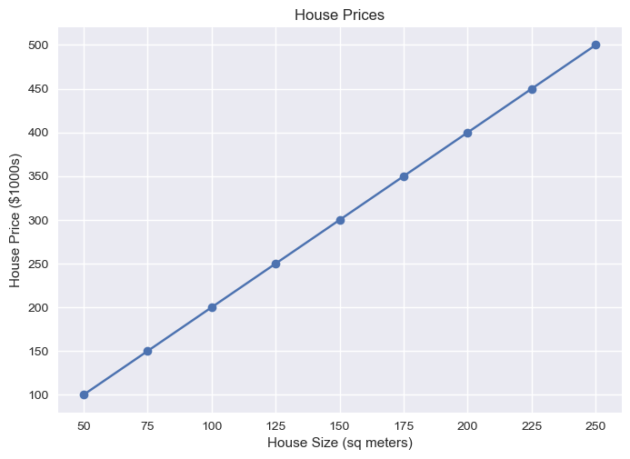

# Standardization



<!---
Maybe Later it should be added
# Angle between vectors

-->

# Covariance


A sample correlation can be seen here:

*Fig 1: House prices based on their sizes. This is just an illustration, it has nothing to do with the real prices, it's just here to explain correlation.*

[Back to Home](/)